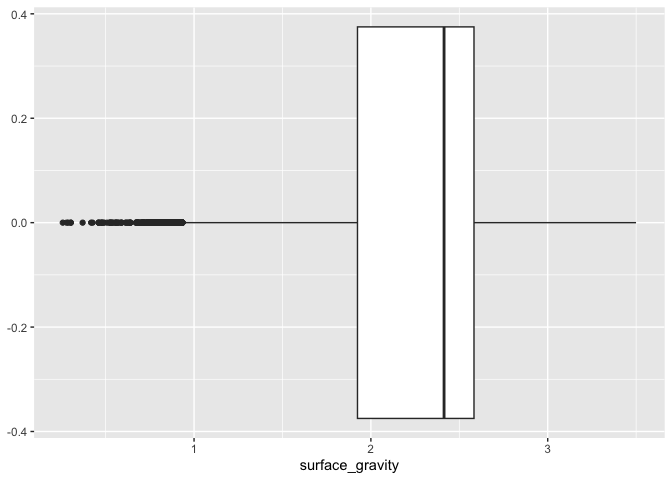
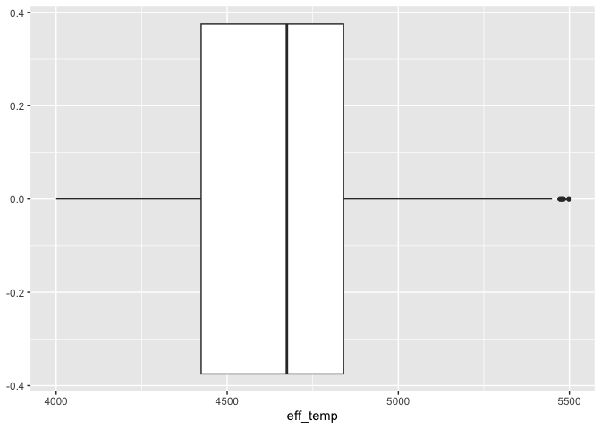
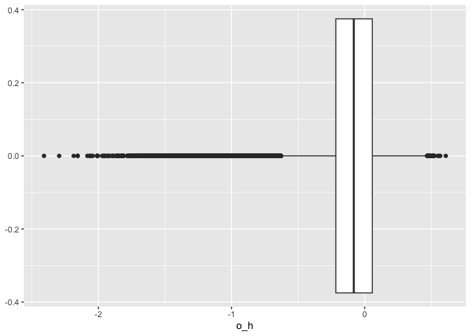
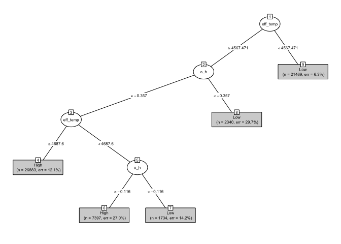
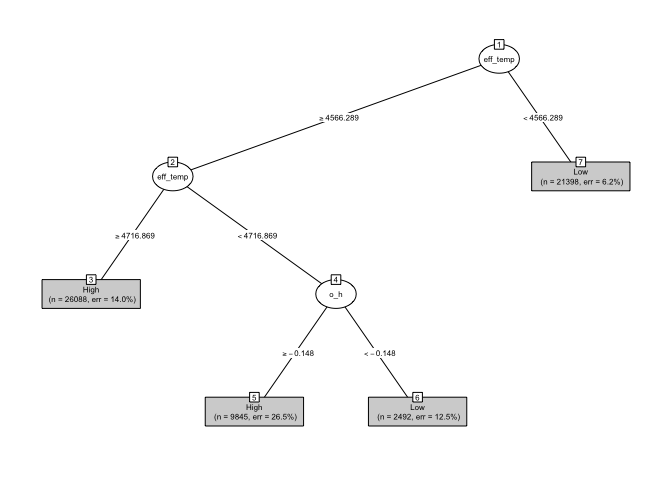
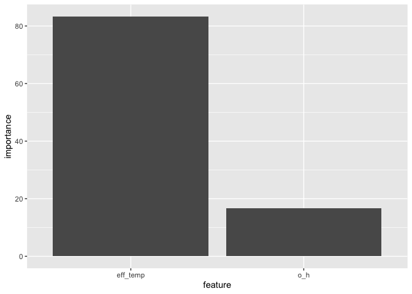
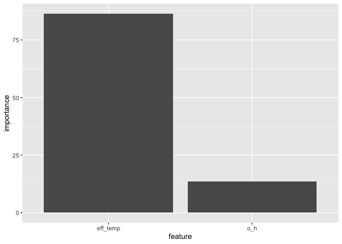

Predicting Surface Gravity on Red Gaint Stars Based on Temperature and
Oxygen Abundance
================

## Introduction

This investigation examines whether the surface gravity on red giant
stars can be classified based on effective temperature and oxygen
abundance.

Data is obtained from the [SDSS APOGEE
survey](https://www.sdss4.org/dr17/irspec/). The dataset used contains
99,705 stellar spectra and associated measurements from red giant stars
collected and pre-processed by [Henry
Leung](https://henrysky.github.io/).

The surface gravity is defined as high when it is above the median of
the surface gravity observations used in this research and low
otherwise. Classification trees are computed using two different
functions to form a mapping of binary decisions that leads to a final
classification outcome. The Gini impurity function makes
decisions/splits based on choices that maximize the “purity” in each
node - the least number of mis-classifications expected across all
objects if guessing randomly. The entropy function makes
decisions/splits based on choices that maximize the amount of
“information” retained with each predicted probability. To determine the
best-performing model, three types of errors are calculated: precision,
recall and classification accuracy. Precision determines if the
prediction is “yes”, and how likely it is correct. Recall determines how
many correct answers are missed. Classification accuracy determines the
number of correct predictions. As a result, this leads to the
exploration of to what degree the two models can accurately predict
whether surface gravity is “high” or “low” using effective temperature
and oxygen abundance.

``` r
library(rhdf5)
library(tidyverse)
library(rpart)
library(partykit)
```

## Data

The analysis uses the STA130_APOGEE.h5 file, looking specifically at the
surface gravity, effective temperature (eff_temp) and abundance of
oxygen (o_h) of the red giant stars collected in the dataset. After
cleaning and removing any missing values, 99,705 observations are stored
in a data frame and used in the study for data processing and analysis.
The variables are defined as follows: \* Surface gravity (base-10
logarithm of cgs units): Acceleration due to gravity experienced at the
surface of a star. \* Effective temperature (Kelvins): How hot the star
is. \* Abundance of oxygen (base-10 logarithm units): How much oxygen is
on the surface of the star compared to the Sun.

``` r
header <- h5ls("~/RStudioProjects/STA130 Capstone/Data/STA130_APOGEE.h5")
header
```

    ##    group       name       otype  dclass          dim
    ## 0      /       al_h H5I_DATASET   FLOAT        99705
    ## 1      /   al_h_err H5I_DATASET   FLOAT        99705
    ## 2      /        c_h H5I_DATASET   FLOAT        99705
    ## 3      /    c_h_err H5I_DATASET   FLOAT        99705
    ## 4      /       ca_h H5I_DATASET   FLOAT        99705
    ## 5      /   ca_h_err H5I_DATASET   FLOAT        99705
    ## 6      /       fe_h H5I_DATASET   FLOAT        99705
    ## 7      /   fe_h_err H5I_DATASET   FLOAT        99705
    ## 8      /       logg H5I_DATASET   FLOAT        99705
    ## 9      /   logg_err H5I_DATASET   FLOAT        99705
    ## 10     /       mg_h H5I_DATASET   FLOAT        99705
    ## 11     /   mg_h_err H5I_DATASET   FLOAT        99705
    ## 12     /        n_h H5I_DATASET   FLOAT        99705
    ## 13     /    n_h_err H5I_DATASET   FLOAT        99705
    ## 14     /        o_h H5I_DATASET   FLOAT        99705
    ## 15     /    o_h_err H5I_DATASET   FLOAT        99705
    ## 16     /        snr H5I_DATASET   FLOAT        99705
    ## 17     /    spectra H5I_DATASET   FLOAT 7514 x 99705
    ## 18     /    star_id H5I_DATASET INTEGER        99705
    ## 19     /       teff H5I_DATASET   FLOAT        99705
    ## 20     /   teff_err H5I_DATASET   FLOAT        99705
    ## 21     / wavelength H5I_DATASET   FLOAT         7514

``` r
stars_data <- "~/RStudioProjects/STA130 Capstone/Data/STA130_APOGEE.h5" %>% h5read("logg") %>% as_tibble() %>% rename(surface_gravity = value)

stars_data$eff_temp <- "~/RStudioProjects/STA130 Capstone/Data/STA130_APOGEE.h5" %>% h5read("teff")
stars_data$o_h <- "~/RStudioProjects/STA130 Capstone/Data/STA130_APOGEE.h5" %>% h5read("o_h")

stars_data <- stars_data %>% na.omit()
stars_data
```

    ## # A tibble: 99,705 × 3
    ##    surface_gravity  eff_temp       o_h
    ##              <dbl> <dbl[1d]> <dbl[1d]>
    ##  1            3.46     5031.   -0.0466
    ##  2            2.48     4976.   -0.318 
    ##  3            2.53     4982.   -0.342 
    ##  4            1.28     4074.   -0.185 
    ##  5            2.58     4757.   -0.0824
    ##  6            2.53     4669.   -0.0716
    ##  7            2.39     4661.    0.111 
    ##  8            2.23     4524.    0.0535
    ##  9            1.59     4148.    0.0605
    ## 10            2.48     4517.    0.117 
    ## # ℹ 99,695 more rows

## Methods/Analysis

Before creating subsets and analyzing the data, the distribution of
surface gravity, effective temperature, and abundance of oxygen is
computed to look for any abnormalities in the data values. The
distributions are illustrated by the following boxplot:

``` r
ggplot(data=stars_data) + aes(x=surface_gravity) + geom_boxplot()
```

<!-- -->

``` r
ggplot(data=stars_data) + aes(x=eff_temp) + geom_boxplot()
```

<!-- -->

``` r
ggplot(data=stars_data) + aes(x=o_h) + geom_boxplot()
```

<!-- -->

While outliers can be seen mainly in the lower extreme of data for
surface gravity and abundance of oxygen and upper extreme for effective
temperature, it is expected that the associated measurements of some
stars may be outside the interquartile range. Therefore, the
observations of these stars are not dropped as these values represent
legitimate data and capture important information on the subject.

*Table 1.0: Statistics of the overall sample size (n) and median of
surface gravity.*

``` r
stars_data %>% summarise(n = n(), median(surface_gravity))
```

    ## # A tibble: 1 × 2
    ##       n `median(surface_gravity)`
    ##   <int>                     <dbl>
    ## 1 99705                      2.41

To compute a model for predicting the surface gravity, a new variable is
created using the mutate() function. The factor stores the value `High`
for stars with a surface gravity greater than the median in Table 1.0,
and `Low` otherwise.

``` r
stars_data <- stars_data %>% mutate(sg_category = case_when(surface_gravity > 2.4 ~ as.factor("High"), surface_gravity <= 2.4 ~ as.factor("Low")))
```

Due to the sheer amount of data, the dataset is divided into three
subsets: training, validation and testing, to prevent overfitting. As
our data may get worse when we add too many parameters into the model,
the training set used to train the model contains 60% of the total data.
The validation set used for deciding which model is best contains 20% of
the data, and the testing set that tests the performance of the
best-performing model contains the remaining 20%.

*Table 2.0: Statistics of the training set, number of observations (n)
in each category (sg_category) and the corresponding median.*

``` r
set.seed(student_num_last3)

n <- nrow(stars_data)
stars_data <- stars_data %>% rowid_to_column(var = "rowid")

training_indices <- sample(1:n, size = 0.6*n)
train <- stars_data %>% filter(rowid %in% training_indices)
train %>% group_by(sg_category) %>% summarise(n = n(), median = median(surface_gravity))
```

    ## # A tibble: 2 × 3
    ##   sg_category     n median
    ##   <fct>       <int>  <dbl>
    ## 1 High        31315   2.57
    ## 2 Low         28508   1.89

*Table 3.0: Statistics of the validation set, number of observations (n)
in each category (sg_category) and the corresponding median.*

``` r
validating_indices <- sample(1:n, size = 0.2*n)
validation <- stars_data %>% filter(rowid %in% validating_indices)
validation %>% group_by(sg_category) %>% summarise(n = n(), median = median(surface_gravity))
```

    ## # A tibble: 2 × 3
    ##   sg_category     n median
    ##   <fct>       <int>  <dbl>
    ## 1 High        10329   2.57
    ## 2 Low          9612   1.89

*Table 4.0: Statistics of the testing set, number of observations (n) in
each category (sg_category) and the corresponding median.*

``` r
testing_indices <- sample(1:n, size = 0.2*n)
test <- stars_data %>% filter(rowid %in% testing_indices)
test %>% group_by(sg_category) %>% summarise(n = n(), median = median(surface_gravity))
```

    ## # A tibble: 2 × 3
    ##   sg_category     n median
    ##   <fct>       <int>  <dbl>
    ## 1 High        10450   2.57
    ## 2 Low          9491   1.89

Classification trees were built using the training data to predict which
stars’ surface gravity category is `High` or `Low` based on the input
features: effective temperature and abundance of oxygen. The feature
importance in percentage is then calculated. The validation data is used
to calculate the confusion matrix: the performance and errors of the
classification algorithms. The performance of the best-performing model
is then tested by computing the confusion matrix and the same metrics
over the test data.

## Results

Classification tree of surface gravity using the Gini impurity loss
function.

``` r
set.seed(student_num_last3 + 1)

tree1 <- rpart(sg_category ~ eff_temp + o_h, data = train)
plot(as.party(tree1), type="simple", gp=gpar(cex=0.5))
```

<!-- -->

Classification tree of surface gravity using the entropy loss function.

``` r
info_tree1 <- rpart(sg_category ~ eff_temp + o_h, data = train, parms=list(split="information"))
plot(as.party(info_tree1), type="simple", gp=gpar(cex=0.5))
```

<!-- -->

Feature importance of variables in the classification tree of surface
gravity using the Gini impurity loss function.

``` r
train_tibble1 <- tibble(importance = tree1$variable.importance/sum(tree1$variable.importance)*100, feature = names(tree1$variable.importance))

ggplot(train_tibble1, aes(x=feature, y=importance)) + geom_col()
```

<!-- -->

Feature importance of variables in the classification tree of surface
gravity using the entropy loss function.

``` r
train_tibble2 <- tibble(importance = info_tree1$variable.importance/sum(info_tree1$variable.importance)*100, feature = names(info_tree1$variable.importance))

ggplot(train_tibble2, aes(x=feature, y=importance)) + geom_col()
```

<!-- -->

Summary of the performance of the Gini impurity classification algorithm
using Gini impurity loss function.

``` r
tree_pred <- predict(tree1, newdata=validation) %>% as_tibble() %>% mutate(prediction = ifelse(High > 0.5, "Predict Yes", "Predict No"))

table(tree_pred$prediction, validation$sg_category)
```

    ##              
    ##               High  Low
    ##   Predict No   754 7817
    ##   Predict Yes 9575 1795

``` r
precision <- c(9575/(1795+9575))
precision
```

    ## [1] 0.8421284

``` r
recall <- c(9575/(754+9575))
recall
```

    ## [1] 0.9270016

``` r
accuracy <- c((9575+7817)/(9575+7817+754+1795))
accuracy
```

    ## [1] 0.8721729

Precision: 84.2% Recall: 92.7% Classification accuracy: 87.2%

Summary of the performance of the classification algorithm using entropy
loss function.

``` r
tree_pred2 <- predict(info_tree1, newdata=validation) %>% as_tibble() %>% mutate(prediction = ifelse(High > 0.5, "Predict Yes", "Predict No"))

table(tree_pred2$prediction, validation$sg_category)
```

    ##              
    ##               High  Low
    ##   Predict No   549 7514
    ##   Predict Yes 9780 2098

``` r
precision <- c(9780/(9780+2098))
precision
```

    ## [1] 0.8233709

``` r
recall <- c(9780/(549+9780))
recall
```

    ## [1] 0.9468487

``` r
accuracy <- c((9780+7514)/(9780+7514+549+2098))
accuracy
```

    ## [1] 0.8672584

Precision: 82.3% Recall: 94.7% Classification accuracy: 86.7%

As can be seen from two summaries above, the two algorithms produce
slightly different results. The classification tree that splits using
Gini impurity has slightly better overall performance compared to the
classification tree using entropy. The Gini impurity tree was tested
again using the testing data to confirm the performance of the model and
whether it performed as expected.

Summary of the performance of the classification algorithm using the
Gini impurity loss function.

``` r
test_tree <- rpart(sg_category ~ eff_temp + o_h, data = test)

test_tree_pred <- predict(test_tree, newdata=test) %>% as_tibble() %>% mutate(prediction = ifelse(High > 0.5, "Predict Yes", "Predict No"))
table(test_tree_pred$prediction, test$sg_category)
```

    ##              
    ##               High  Low
    ##   Predict No   588 7664
    ##   Predict Yes 9862 1827

``` r
precision = 9862/(1827+9862)
precision
```

    ## [1] 0.8436992

``` r
recall = 9862/(588+9862)
recall
```

    ## [1] 0.9437321

``` r
accuracy = (9862+7664)/(9862+7664+588+1827)
accuracy
```

    ## [1] 0.8788927

Precision: 84.4% Recall: 94.4% Classification accuracy: 87.9%

Based on the calculations of errors in the summary table above, the
performance from testing matches up well based on the results from the
validation data. The quantities for each metric with the test data are
similar to the ones obtained previously from the validation set.

The surface gravity on a star is “high” or “low” and can be predicted
relatively accurately from its respective effective temperature and
abundance of oxygen using a classification tree. For this investigation,
using the Gini impurity method to build the tree led to the best
performance. Looking at the feature importance in Figures 9.0 and 11.0,
the effective temperature of a star matters significantly more than its
abundance of oxygen when determining the surface gravity category.

## Conclusion

Based on the generated confusion matrix of the classification models,
the high precision, recall and classification accuracy values indicate
that the model can be used for largely accurate predictions of whether
the surface gravity on a star is above the median (classified as “High”)
or below (classified as “Low”) using its effective temperature and
abundance of oxygen. For this investigation, using the Gini impurity
method to build the tree led to the best performance. The results imply
that there is an unlying relationship between the surface gravity and
two input features, especially effective temperature, because of its
high feature importance. Examining the trees, the relationship may be
direct; the higher the effective temperature, the more likely the
surface gravity is “High” and vice versa. However, additional tests and
research would need to be conducted in future work to confirm this
hypothesis.
